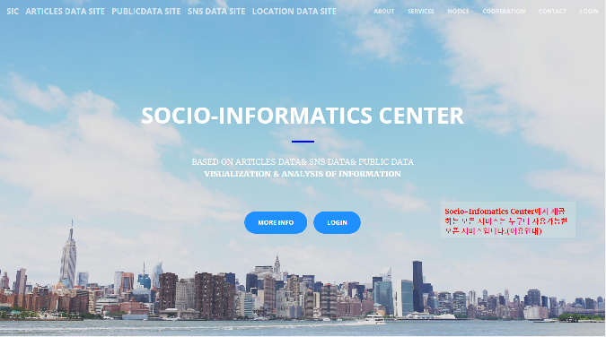
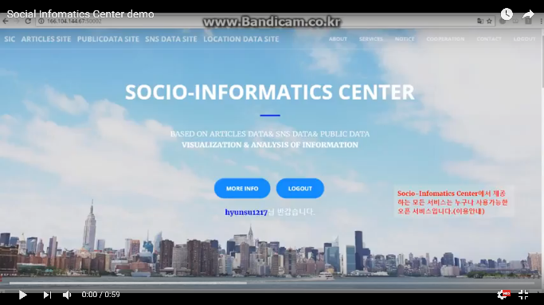

# Social-Infomatics
## http://166.104.144.67:50002/

Socio-Infomatics-Center는 사회문제를 데이터기반으로 분석하여 문제해결을 위한 정책결정이나 방향을 좀 더 객관적,정확하게 만들기 위한 방법으로써 사용될 수 있다.

1. Social Infomatics Center

http://166.104.144.67:50002/

2. 시연 영상

https://www.youtube.com/watch?v=T3URtHRoIgM

## 연구 목표
웹 데이터 추출은 여러 과학적 장치로써, 그리고 다양한 어플리케이션에서 사용되어 왔다. 많은 웹 데이터 추출 접근법은 특정한 문제를 해결하거나 ad-hoc한 분야에서 사용되기 위해 설계되어왔다. 일반적인 웹 정보 검색 방법으로 최근의 복잡한 웹 페이지와 웹 서비스들의 웹 데이터를 수집하는 것은 어렵고 이는 더욱 심화될 것이다. 따라서 우리는 최근의 복잡한 웹 페이지에 일반적으로 적용 가능한 “중심 블록 이론”을 제시하고 이를 통해 최신 웹 기술이 적용된 웹 페이지를 보다 구조적으로 이해하고, 각 블록이 가지는 보다 상세한 정보를 수집할 수 있을 것이다.

## 연구 개발 내용
중심 블록 이론을 통한 웹 블록 단위 데이터 추출
인간에게 제공되는 웹 서비스의 경우 핵심적인 내용을 담은 블록일수록 화면 중심에 나타나는 경우가 많으며 중심에서 벗어날수록 중요도가 떨어지는 블록들이 나타난다. 즉, 지금의 웹 환경에서 사용자에게 표현되는 정보를 기반으로 웹 페이지를 파악하는 것은 가장 정확한 방법이라고 할 수 있으며 이를 기계적으로 파악하기 위해서는 시각적 표현 정보를 종합하여 “중심에 위치하는 블록”을 유추하여야 한다.
하지만 현재의 웹 페이지는 사용자의 행동에 따른 "중심"이 매우 가변적이므로 실제 클라이언트 환경에서 발생할 수 있는 사용자 이벤트를 시도하고 웹 페이지의 반응을 종합하여 가능한 “중심” 중 어떤 블록이 사용자가 인식한 “중심에 위치한 블록”에 가까운지 기술적으로 판단해야 한다. 
Programmatic injection을 활용한 정보의 표시와 추출
브라우저/사용자 이벤트가 웹 페이지의 중심을 포함한 다양한 정보를 실시간으로 변화시킬 수 있다. 또한 웹 환경의 분화에 따라 각종 지엽적인 센서를 탑재한 단말기들도 웹에 접속 가능해지면서 기존 환경과는 상이한 데이터들이 웹을 통해 처리될 수 있게 되었다. 이로 인해 웹 페이지, 이벤트, 디바이스의 처리방식 등 가능한 조합이 무수히 많아짐에 따라 웹 접근성이 웹 기술을 따라가지 못하는 현상이 발생한다. 본 연구에서는 서로 다른 이벤트의 매칭을 통해 가상적인 이벤트로 기존에 불가능하던 웹 이용이 가능하도록 하는 고수준의 이벤트 제어 기술을 연구한다. 이벤트 제어 기술을 통해 보다 다양한 웹 환경과 상황에 따른 웹 페이지의 정보 변화를 관측, 수집, 추출할 수 있고 이 기술은 웹 페이지 블록의 기능적 요소를  파악할 수 있게 되며 이를 통해 보다 정확한 웹 페이지 블록 추출을 가능하게 한다. 
